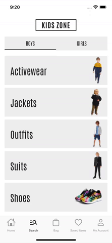
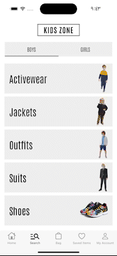
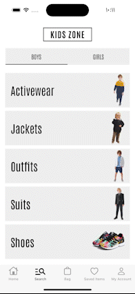
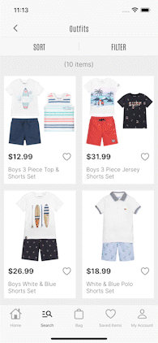
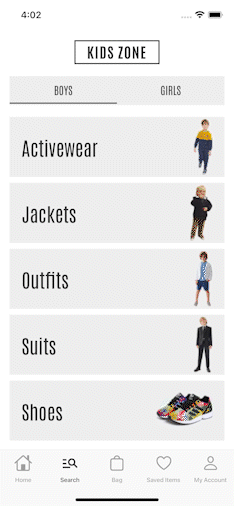

# Kids Zone - Clothes for Kids

Kids Zone is an online store offering a delightful collection of clothes for kids.


## Features

The Kids Zone app includes the following exciting features:

### 1. Browse Categories

Users can explore a wide range of clothing categories, including tops, bottoms, dresses, suits, and more Additionally, users have the option to toggle between "Boys" and "Girls" to find clothing items for their specific needs.



### 2. Product Search and Filtering

The product search functionality allows users to find specific clothing items quickly. Users can search by brand, color, size, and price range, making it easy to discover the desired outfits. They can use one or combine multiple search filters to refine their search results.



### 3. Sort Products

Users can also sort the search results based on different criteria: Newest, Price High to Low, and Price Low to High.



### 4. Bag

Users can add their selected items to the shopping cart for easy checkout and purchase. The cart also displays the total cost and allows users to modify their order as needed.



### 5. Save Favorites

Users can create a wishlist of favorite items they want to save for future reference or compare before making a final decision.



### 6. Authentication

- **User Registration**: New users can easily create an account by providing their email address and setting a password.

- **User Login**: Existing users can log in securely using their registered email and password.

### 7. Account Management

The Account Management feature provides users with full control over their account settings, including:

- **User Details**: Users can change their email, first name, and last name associated with the account.

- **Change Password**: Users can update their password to a new one for enhanced security.

- **Address Book**: Users can manage their address book by adding new addresses or deleting existing ones.

- **Payment Methods**: Users can add or remove payment methods for smooth and secure transactions.

- **App Appearance**: Users can toggle between light and dark mode for a personalized visual experience.

## Backend Information

The backend for the Kids Zone app is developed using **TypeScript** and **Express.js** framework. The database is powered by **MongoDB**. You can find the backend repository at the following link:

[Link to Backend Repository](https://github.com/fateh-kudsi-11/kids-zone-B-v2)

The backend handles data management, authentication, and communication with the MongoDB database.

The backend is deployed on [Render](https://render.com/). However, please note that being on a free tier hosting service, there might be **occasional delays** while launching the app.

## Installation

1. Clone this repository to your local machine.

   ```bash
   git clone https://github.com/fateh-kudsi-11/kids-zone-swift-UIKIT.git
   ```

2. Ensure you have Swift Package Manager (SPM) installed on your machine.

3. Use Swift Package Manager to resolve and fetch the required dependencies. In Terminal, navigate to the project root directory and run:

   ```bash
   swift package resolve
   ```

4. Run the app on your device using Xcode.

## Feedback and Contributions

We welcome your feedback and contributions to make the Kids Zone app even better! If you encounter any issues or have ideas for new features, please open an issue or submit a pull request on our GitHub repository.

## License

The Kids Zone app is open-source and licensed under the [MIT License](LICENSE).
